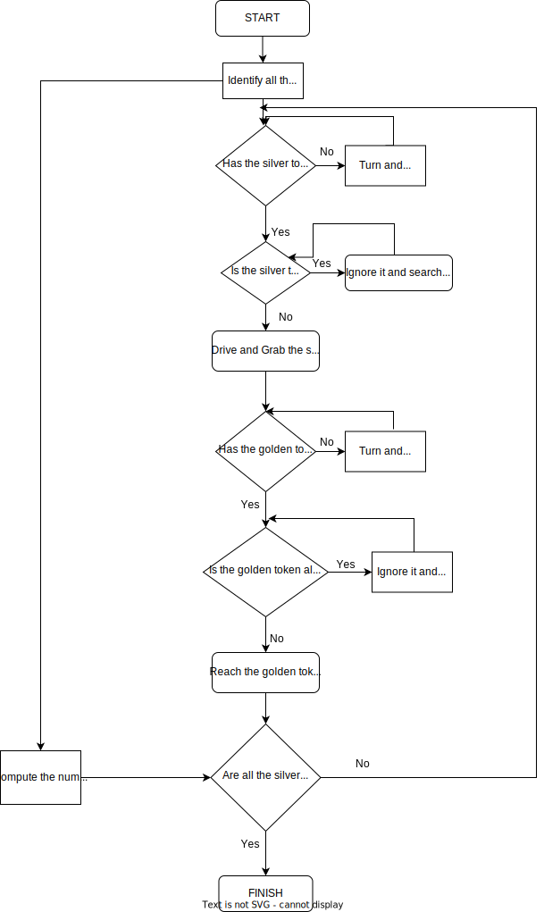

# Research Track 1 - First Assignment
Python Robotics Simulator
================================

This is a simple, portable robot simulator developed by [Student Robotics](https://studentrobotics.org).
Some of the arenas and the exercises have been modified for the Research Track I course. 

The purpouse of this work is to make an holonomic robot to move around a given arena and to pair silver token to the golden ones. The process of paring is achieved by grabbing silver token and carrying them through the arena, dropping them only when the robot is close enough to a golden object. It's important to point out that each one of the golden token is paired with only one of the silver token and that the behavior of the robot has to be as much indipendent as possibile from the layout of a given arena. 


Installing
-----------------------------

The simulator requires a Python 2.7 installation, the [pygame](http://pygame.org/) library, [PyPyBox2D](https://pypi.python.org/pypi/pypybox2d/2.1-r331), and [PyYAML](https://pypi.python.org/pypi/PyYAML/).

Pygame, unfortunately, can be tricky (though [not impossible](http://askubuntu.com/q/312767)) to install in virtual environments. If you are using `pip`, you might try `pip install hg+https://bitbucket.org/pygame/pygame`, or you could use your operating system's package manager. Windows users could use [Portable Python](http://portablepython.com/). PyPyBox2D and PyYAML are more forgiving, and should install just fine using `pip` or `easy_install`.

## Troubleshooting

When running `python run.py <file>`, you may be presented with an error: `ImportError: No module named 'robot'`. This may be due to a conflict between sr.tools and sr.robot. To resolve, symlink simulator/sr/robot to the location of sr.tools.

On Ubuntu, this can be accomplished by:
* Find the location of srtools: `pip show sr.tools`
* Get the location. In my case this was `/usr/local/lib/python2.7/dist-packages`
* Create symlink: `ln -s path/to/simulator/sr/robot /usr/local/lib/python2.7/dist-packages/sr/`


Running
-----------------------------

To run one or more scripts in the simulator, use `run.py`, passing it the file names. 

You can run the program with:

```bash
$ python run.py assignment.py
`

Flowchart of how the program works:
----------------------------------
 



Robot API
-----------------------------

The API for controlling a simulated robot is designed to be as similar as possible to the [SR API][sr-api].

### Motors ###

The simulated robot has two motors configured for skid steering, connected to a two-output [Motor Board](https://studentrobotics.org/docs/kit/motor_board). The left motor is connected to output `0` and the right motor to output `1`.

The Motor Board API is identical to [that of the SR API](https://studentrobotics.org/docs/programming/sr/motors/), except that motor boards cannot be addressed by serial number. So, to turn on the spot at one quarter of full power, one might write the following:

```python
R.motors[0].m0.power = 25
R.motors[0].m1.power = -25
```

### The Grabber ###

The robot is equipped with a grabber, capable of picking up a token which is in front of the robot and within 0.4 metres of the robot's centre. To pick up a token, call the `R.grab` method:

```python
success = R.grab()
```

The `R.grab` function returns `True` if a token was successfully picked up, or `False` otherwise. If the robot is already holding a token, it will throw an `AlreadyHoldingSomethingException`.

To drop the token, call the `R.release` method.

Cable-tie flails are not implemented.

### Vision ###

To help the robot find tokens and navigate, each token has markers stuck to it, as does each wall. The `R.see` method returns a list of all the markers the robot can see, as `Marker` objects. The robot can only see markers which it is facing towards.

Each `Marker` object has the following attributes:

* `info`: a `MarkerInfo` object describing the marker itself. Has the following attributes:
  * `code`: the numeric code of the marker.
  * `marker_type`: the type of object the marker is attached to (either `MARKER_TOKEN_GOLD`, `MARKER_TOKEN_SILVER` or `MARKER_ARENA`).
  * `offset`: offset of the numeric code of the marker from the lowest numbered marker of its type. For example, token number 3 has the code 43, but offset 3.
  * `size`: the size that the marker would be in the real game, for compatibility with the SR API.
* `centre`: the location of the marker in polar coordinates, as a `PolarCoord` object. Has the following attributes:
  * `length`: the distance from the centre of the robot to the object (in metres).
  * `rot_y`: rotation about the Y axis in degrees.
* `dist`: an alias for `centre.length`
* `res`: the value of the `res` parameter of `R.see`, for compatibility with the SR API.
* `rot_y`: an alias for `centre.rot_y`
* `timestamp`: the time at which the marker was seen (when `R.see` was called).

For example, the following code lists all of the markers the robot can see:

```python
markers = R.see()
print "I can see", len(markers), "markers:"
for m in markers:
    if m.info.marker_type in (MARKER_TOKEN_GOLD, MARKER_TOKEN_SILVER):
        print " - Token {0} is {1} metres away".format( m.info.offset, m.dist )
    elif m.info.marker_type == MARKER_ARENA:
        print " - Arena marker {0} is {1} metres away".format( m.info.offset, m.dist )
```

[sr-api]: https://studentrobotics.org/docs/programming/sr/


Implemented functions
-----------------------------

 - `drive(speed, seconds)`:  Function for setting a linear velocity  
                           Args:  `speed (int)`: the speed of the wheels; `seconds (int)`: the time interval
```
	R.motors[0].m0.power = speed
	R.motors[0].m1.power = speed
	time.sleep(seconds)
	R.motors[0].m0.power = 0
	R.motors[0].m1.power = 0
```

 - `turn(speed, seconds)`:  Function for setting an angular velocity  
                          Args:  `speed (int)`: the speed of the wheels; `seconds (int)`: the time interval
```
	R.motors[0].m0.power = speed
	R.motors[0].m1.power = -speed
	time.sleep(seconds)
	R.motors[0].m0.power = 0
	R.motors[0].m1.power = 0
```

 - `find_silver_token()`:  Function for finding the closest silver token that is not yet grabbed
                         Returns:  `dist (float)`: distance of the closest token (-1 if no token is detected); `rot_y (float)`: angle between the robot and the token (-1 if no token is detected);
```
	 global List_silver 
    dist=100
    for token in R.see():
        if token.dist < dist and token.info.marker_type is MARKER_TOKEN_SILVER and token.info.offset not in List_elements_removed:
            dist=token.dist
            rot_y=token.rot_y
    if dist==100:
        return -1, -1
    else:
        return dist, rot_y
```

 - `find_golden_token()`:  Function for finding the closest golden token that is not yet paired
                       Returns:  `dist (float)`: distance of the closest token (-1 if no token is detected); `rot_y (float)`: angle between the robot and the token (-1 if no token is detected); 
```
	global List_golden
    	dist=100
    	for token in R.see():
        	if token.dist < dist and token.info.marker_type is MARKER_TOKEN_GOLD and token.info.offset not in List_golden:
            	dist=token.dist
            	rot_y=token.rot_y
    	if dist==100:
        	return -1, -1
    	else:
   		return dist, rot_y
```
                                                                                 
 - `vision_all_silver()`:  Function for seeing all the silver tokens in the arena

```
 markers = R.see()
    global List_silver
    global List_golden
    global max_silver_token_number
    global position_silver
    for m in markers:
        if( m.info.marker_type == MARKER_TOKEN_SILVER):
            print ("Token Silver",m.info.offset, "is metres away", m.dist)
            if m.info.offset not in List_silver:
                if m.info.offset not in List_elements_removed:
                    List_silver.insert(position_silver,m.info.offset)
                    print('List Silver is', List_silver)
                    position_silver = position_silver +1
                    max_silver_token_number = max_silver_token_number +1
                    print( 'max_silver_token_number is', max_silver_token_number)                
                    print("Silver_Token_List",List_silver)
                    print("Maximum silver token number", max_silver_token_number)
```
                                             
 - `get_offset_silver:  Function for getting the offset value of a silver token 
 
 			Returns: offset                                        
```
    	offset=1
    	dist=100
    	markers = R.see()
    	for m in markers:
        	if m.dist < dist and m.info.marker_type is MARKER_TOKEN_SILVER:
            	offset=m.info.offset
            	dist=m.dist
       
    	return offset
```

 - `get_offset_gold()`:  Function for getting the offset value of a golden token 
 
                         Returns: offset
```
	offset=1
    	dist=100
        markers=R.see()
    	for m in markers:
       		if m.dist < dist and m.info.marker_type is MARKER_TOKEN_GOLD:
        	offset=m.info.offset
        	dist=m.dist
   	return offset
```

 - `avoid_obstacles_silver()`:  Function for avoiding silver obstacles if a silver token is already taken. It is useful for avoiding that the robot drags aroung another silver token

```	
	d_th = 0.6
    	markers = R.see()
   	for m in markers:
        	if m.info.marker_type is MARKER_TOKEN_SILVER and m.dist < d_th and grabbed== True and m.info.offset not in List_elements_removed:
                	if 0 <=m.rot_y:
                		turn(-20,1)
                		drive(20,1)
                		turn(+20,1)
            		else:
                		turn(+20,1)
                		drive(20,1)
                		turn(-20,1
	
	
		
```
